# Hi, I'm Eva 👋

I'm a software engineer and University of Washington Computer Science graduate. I previously built research software for systems biology at the Center for Reproducible Biomedical Modeling.

I enjoy working on developer tools, research software, and web applications, especially projects that involve technical ownership and unclear requirements.

## Experience

### Lead Software Engineer — [CRBM](https://reproduciblebiomodels.org/about/#team)

I worked on open-source tools that helped researchers create and edit biological models.

**[Antimony Web Editor](https://github.com/sys-bio/AntimonyEditor)**
Led development of a browser-based editor built with React and TypeScript. I planned features, made technical decisions, coordinated development, and presented the project at the COMBINE conference.

**[VSCode-Antimony](https://github.com/sys-bio/vscode-antimony)**
Helped build a VS Code extension that provides language tooling for Antimony models and reduces manual setup. It has reached more than 1,000 users.

## Skills

**Languages:** TypeScript, JavaScript, Python, SQL
**Technologies:** React, Next.js, Tailwind CSS, FastAPI, PostgreSQL, Supabase

## Currently

I'm building full-stack projects, taking on freelance work, and looking for software engineering roles involving developer tools, research infrastructure, or web applications.

## Links

[My Website](https://www.lilacplanet.dev/) · [Email](mailto:evaxliu02@gmail.com)
